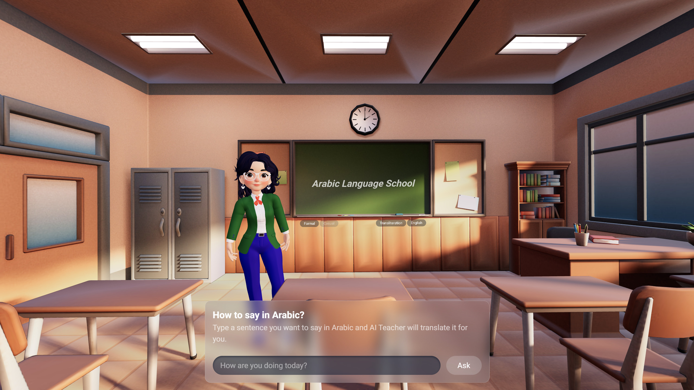

# RAMSA - Arabic AI Teacher



This project is a web application built using React, Three.js, Next.js, Zustand, Yarn, Falconllm, and Azure TTS. The purpose of this application is to provide a virtual classroom experience where users can translate Arabic words and view the translation, transliteration, and pronunciation in a 3D classroom setting with a virtual teacher.

## Features

- Translation: Enter any Arabic word and get its translation in real-time.
- Transliteration: View the transliteration of the Arabic word to understand its pronunciation.
- Pronunciation: Listen to the pronunciation of the translated word using Azure TTS.
- 3D Classroom: Experience a virtual classroom environment with a 3D teacher.

## Technologies Used

- React: A JavaScript library for building user interfaces.
- Three.js: A JavaScript library for creating and displaying 3D graphics in the browser.
- Next.js: A React framework for building server-side rendered and static websites.
- Zustand: A small, fast, and scalable state management library for React.
- Yarn: A package manager for managing project dependencies.
- Falconllm: Falcon180b instruct is an opensource model from TII consumed using AI71 api.
- Azure TTS: Azure Text-to-Speech service for generating spoken audio from text.

## Getting Started

To run this project locally, follow these steps:

```bash
# Clone the repository
git clone https://github.com/hamsathul/ai_teacher.git

# Install the project dependencies using Yarn
cd ai_teacher
yarn install

# Start the development server
yarn dev

# Open the application in your browser
```


## Usage

1. Enter an Arabic word in the input field.
2. View the translation, transliteration, and pronunciation of the word.
3. Explore the 3D classroom environment and interact with the virtual teacher.

## Contributing

Contributions are welcome! If you would like to contribute to this project, please follow the guidelines outlined in the CONTRIBUTING.md file.

## License

This project is licensed under the MIT License. See the LICENSE.md file for more details.
